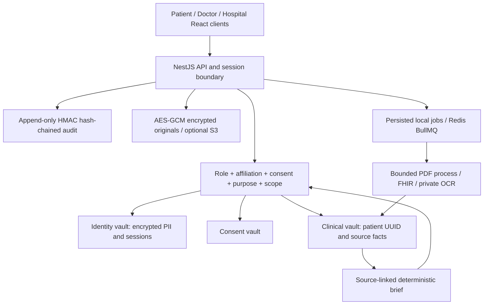

# Architecture and trust boundaries

The local implementation is a three-tier client/server system: React presentation, a NestJS modular monolith, and encrypted persistence. Medical processing runs asynchronously, so queued documents do not block existing briefs.

## What is enforced

- Self-only patient access. Clinicians need a verified account, matching hospital affiliation, an explicit consent identifier, matching purpose, active status and unexpired validity.
- Record-type/date filtering is applied before facts are summarized. Original source downloads are blocked when any extracted fact in the document lies outside the allowed dates. This conservative check still cannot prove every unextracted statement is in scope; a production source-redaction design is required.
- Hospital administrative roles cannot access clinical endpoints, even if they possess a valid clinician consent identifier.
- Browser sessions use random opaque tokens; only hashes are stored. Access cookies expire after 15 minutes, refresh cookies after 8 hours. Refresh tokens rotate and reuse revokes their session family. SameSite cookies, CSRF tokens, origin checks and security headers protect browser requests.
- TOTP enrollment and replay checks are implemented. External identity/professional verification and recovery are separate outstanding capabilities.
- Identity, clinical and audit payloads use distinct AES-256-GCM keys. Email account lookup uses a keyed HMAC. Passwords use salted scrypt.
- Local storage uses separate database files; PostgreSQL uses separate schemas. Audit rows are never updated through the Store API, and SQLite additionally rejects UPDATE/DELETE with triggers. Audit events form a keyed hash chain checked by the administration UI.
- Uploaded files have MIME/magic, size, duplicate-hash and basic active-PDF checks. Images have pixel limits. PDF text extraction runs in a subprocess with a 128 MB JS heap, 30-second timeout, 100-page cap and output cap. The subprocess receives no application secrets in its environment.
- Extraction accepts conservative, labeled source statements and supported FHIR resources. It preserves negation, family context, uncertainty and history. No model or external inference service is called. The `source-stated` label describes source support, not clinical confirmation.
- FHIR Patient resources and direct identity fields are not copied into normalized facts. Original records can contain identifying information and remain encrypted inside the trusted intake boundary.

## Threat model and remaining security work

| Threat                             | Current mitigation                                                              | Remaining requirement                                                                                             |
| ---------------------------------- | ------------------------------------------------------------------------------- | ----------------------------------------------------------------------------------------------------------------- |
| Stolen clinician cookie            | Short session, revocation, optional MFA, consent checks                         | Device binding, privileged MFA bootstrap/recovery and external identity verification                              |
| Cross-patient / cross-tenant reads | Authorization on every clinical endpoint                                        | Independent penetration testing and large adversarial suite                                                       |
| Database theft                     | Encrypted payloads, randomized clinical patient references                      | Separate service principals, database credentials, patient-scoped KMS envelope keys                               |
| Compromised API process            | Modules and separate encryption domains                                         | API currently holds all keys; split identity brokerage/clinical services and deny broad key access                |
| Compromised parser                 | Bounded subprocess, patched parser, no passed secrets                           | OS/container sandbox denying filesystem/network access; private OCR hardening                                     |
| Tampered audit                     | Append-only interface, SQLite triggers, keyed hash chain                        | Independent WORM destination, external checkpoints, PostgreSQL grants/triggers and scalable append implementation |
| Prompt injection                   | No LLM; labeled deterministic extraction; suspicious instruction filter         | Broad adversarial clinical extraction evaluation, private model governance if added                               |
| Malicious callback                 | Signed custom HMIS payload, timestamp window, consent correlation and replay ID | Provider-specific authentication, durable atomic replay ledger across replicas, full ABDM protocol                |
| Bulk extraction                    | General request rate limit and clinical audit events                            | Distributed DLP, anomaly detection, alerting and export governance                                                |
| Retention overrun                  | Patient-controlled record/fact deletion                                         | Legal holds, automated governed retention, backup expiry and complete erasure workflow                            |

The local monolith serializes HTTP mutations to avoid intra-process token/consent races. PostgreSQL audit appends also take an advisory transaction lock. This is not a substitute for transactional, per-service concurrency control across multiple API replicas. Audit verification currently reads the whole chain and should be redesigned with indexed sequence/head storage for scale.

## Production gate

`NODE_ENV=production` intentionally refuses startup. Removing the gate alone does not make this implementation production-ready. The PRD's rule that one compromised service cannot expose both identity and complete history is not met by one process with access to all vault keys. Before a pilot, complete the outstanding service/key isolation, network infrastructure, integration validation, clinical benchmarks and security assessment in `WORK_STATUS.md`.

No break-glass override exists. No user role can silently bypass consent. No training on uploaded records occurs.
