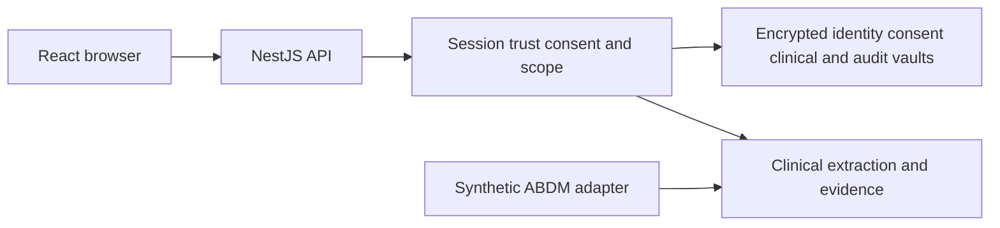

# G1 Health Application Context

Updated 11 September 2026. Companion to G1_APP_CONTEXT.docx.

| STATUS / Synthetic demo ready |  | PROJECT / G1 |  | UPDATED / 11 September 2026 |
| --- | --- | --- | --- | --- |

| Audience | Developers and project handoff recipients |
| --- | --- |
| Validation | Clinical and independent security review pending |
| Context files | G1_APP_CONTEXT.docx and G1_APP_CONTEXT.md |
| Scope | Current web app architecture storage workflows and deployment status |

## 1  Application Overview

G1 is an emergency health history web application. It turns authorized records into a source-linked clinical brief so a clinician can review important history quickly. This document captures the implemented application, repository structure, storage, demo operation and remaining work for developers and future handoffs.

The local synthetic workflow is implemented and tested. Render deployment files are prepared, but no hosted deployment is confirmed. ABHA, professional verification and health-information retrieval use a mock adapter. The system is not medically validated and production startup remains blocked.

## 2  Goals and Exclusions

| Goals | Excluded capabilities |
| --- | --- |
| Consent controlled access to health history | Silent access or unrestricted break glass |
| Evidence linked brief and visible conflicts | Automatic diagnosis or prescribing |
| Patient doctor and hospital web workspaces | Mobile app and payment flows |
| Synthetic demonstration with protected storage | Real patient production use or live ABDM claims |

## 3  Roles and Project Context

Patients control identity connections, records and consent. Doctors must have an active verified account and verified hospital affiliation before resolving identity or requesting health information. Hospital administrators manage organizational access and audit activity; they cannot read patient clinical histories.

The workspace is D:\Pratham\G1 and the Git remote is https://github.com/pratham9766/G1. The application uses React 19, Vite 6 and TypeScript in the browser, with NestJS 11 and Express 5 on Node.js 22. Preserve the existing UI and authorization boundaries when extending it.

## 4  Architecture and Storage

SSE carries workflow progress only. Protected clinical reads require current consent.

### Core components

| Component | Responsibility | Primary storage | Failure behavior |
| --- | --- | --- | --- |
| React web UI | Role workspaces scanner consent and brief | Browser state only | Shows errors and clears revoked access |
| NestJS API | Sessions trust scope and purpose checks | Identity and consent vaults | Denies unauthorized access |
| Workflow adapter | Async consent retrieval and retries | Persisted consent state | Mock only or unavailable |
| Clinical pipeline | Parse normalize evidence and brief | Clinical vault and encrypted objects | Source linked fallback |
| Audit service | Record access and consent actions | Audit vault | Integrity checks and append only writes |

Local database directory: D:\Pratham\G1\data. identity.sqlite stores accounts and connections; clinical.sqlite stores records and extracted facts; consent.sqlite stores grants and request state; audit.sqlite stores access events. Sensitive payloads are encrypted; indexing metadata is not a full-disk encryption boundary.

Original source files are encrypted under data\objects. DATA_DIR can override the location. PostgreSQL is optional through DATABASE_URL, but is not the active default. Backups must preserve databases, original objects and their matching keys; do not commit any of them.

On the proposed Render service, the disk mount is /opt/render/project/src/data. render.yaml configures one Node instance and a persistent disk. Hosting access and service cost approval are still pending.

## 5  Patient and Doctor Workflow

Patient signs in and connects the synthetic ABHA address aarav.sharma@abdm. G1 shows masked identity, verification timestamps and a signed identity-only QR valid for 10 minutes.

A doctor scans with the camera, uploads a QR image or enters an ABHA identifier. G1 validates doctor and hospital trust and creates a doctor-bound access session valid for 15 minutes. Only minimal identity is shown.

Doctor selects a purpose, information categories, date range and expiry of up to 24 hours. Categories include allergies, medications, diagnoses, procedures, labs, discharge summaries, imaging, immunizations and encounters.

Patient explicitly grants or denies the request. Consent is never preselected or silently approved. Active access can be revoked; expired access remains visible in consent history.

After approval, persisted stages progress through data requested, data received, processing and ready. The mock adapter supplies synthetic envelopes to validation and encrypted ingestion, then extraction and evidence indexing.

The clinician opens a 10-second, 30-second or detailed brief with timeline, source evidence, original authorized records and annotations. Conflicting sources and low confidence remain visible. No diagnosis or treatment recommendation is generated.

SSE updates request progress without refresh. Revocation or expiry denies subsequent protected API access; live events clear the open clinician brief. Audit records capture resolution, decisions, retrieval and clinical access.

## 6  APIs and Data Contracts

### Primary workflow APIs

All API paths below use the /api/v1 prefix. The table groups related operations; see docs/API.md and workflow/controller.ts for full routes.

| API group | Methods | Access | Purpose |
| --- | --- | --- | --- |
| /workflow/identity | GET POST DELETE | Patient | Connect refresh inspect or disconnect identity |
| /workflow/resolve | POST | Doctor | Resolve QR or manual identifier |
| /workflow/requests | GET POST | Role scoped | Create and list requests |
| /requests/:id/decision | POST | Patient | Approve deny or revoke under /workflow |
| /workflow/events | GET SSE | Session | State only live workflow events |
| /patients/:id/brief | GET | Authorized | Brief timeline and source linked facts |
| /facts/:id/evidence | GET | Authorized | Source excerpts and confidence |

### Contract guarantees

Every protected clinical request validates role, doctor, hospital, patient, purpose, consent, scope and expiry. Unverifiable consent status denies access.

New workflow resources use UUIDs. Legacy deterministic opaque fact IDs are preserved. Correlation IDs, source hashes and webhook event IDs support provenance and duplicate detection.

Every clinical claim retains a source record reference, source document, date, section or page where available, and extraction confidence. Unsupported claims are not confirmed facts.

Migration 002 adds indexed relational projections over encrypted entity payloads with same-vault foreign keys. It preserves existing data; it is not a complete normalized multi-service database redesign.

Detailed API and architecture references are in docs/API.md, docs/ARCHITECTURE.md and docs/NEXT_STAGE_HANDOFF.md.

Workflow contracts are implemented in server/workflow/models.ts and server/workflow/adapters.ts.

## 7  Failure Handling and Consistency

The local server serializes state-changing HTTP requests and workflow mutations in process. Per-document promises prevent duplicate processing within one server. Persisted retry state supports recovery. Atomic multi-vault transactions and distributed job ownership remain future production work.

| Scenario | Expected behavior | Reason |
| --- | --- | --- |
| Duplicate webhook | Validate signature timestamp ID and body hash | Do not apply the same event twice |
| Consent cannot be verified | Deny protected data reads | Do not rely on stale approval |
| Provider or AI failure | Bounded retrieval retries or source linked fallback | No stale data labeled as fresh |
| Revocation expiry or mode change | Reject invalid consent on protected reads | Delayed events cannot revive terminal consent |

## 8  Security and Privacy

Opaque access cookies expire after 15 minutes; refresh cookies rotate with an eight-hour window and reuse detection. Passwords use scrypt. TOTP support, CSRF checks, origin checks, rate limits and security headers are implemented.

Clinical data and source documents are encrypted with AES-256-GCM. Clinical evidence and original downloads remain consent scoped. Full ABHA, raw health contents, access tokens and OTPs must not be placed in operational logs.

Local keys are in data/development-keys.json. Keep them private and backed up with controlled access. The hosted profile derives distinct vault keys from G1_DEMO_MASTER_KEY and does not write a development-key file. Never rotate or delete keys without a data migration and recovery plan.

Hosted demo mode requires HTTPS, mock ABDM and local clinical processing. Cookies are Secure, HttpOnly and SameSite Strict. Registration, arbitrary document uploads and external callbacks are blocked. Local development retains its existing upload workflow.

Audit events are append-only through the application and hash chained; SQLite triggers reject audit updates and deletes. The API still holds all vault keys. External key isolation, independent audit storage, governed retention and clinical/security validation remain required before production.

## 9  Setup and Validation

| Check | Latest recorded result | Context | Status |
| --- | --- | --- | --- |
| Build and types | TypeScript and Vite passed | Local workspace | Passed |
| API and clinical suite | 31 tests passed after hosting changes | Node test runner | Passed |
| Browser regression | 6 Chrome scenarios passed before hosting changes | Local workflow | Passed |
| Hosted profile | Secure cookies keys and blocked routes verified | Local integration test | Passed |
| Public deployment | TLS disk persistence and live browser checks not run | Render target | Pending |
| Deployment must remain synthetic. Production is blocked; deployment configuration does not establish a hosted service. |  |  |  |

Local run: npm ci; npm run migrate; npm run seed:workflow; npm run build; npm start. Open http://127.0.0.1:3001. For hot reload use npm run dev and http://127.0.0.1:5173.

Windows npm workaround: invoke & 'C:\Program Files\nodejs\npm.cmd' with command arguments because the global PowerShell npm shim is broken on this machine.

Demo accounts: aarav@g1.demo for Aarav Sharma; meera@g1.demo for Dr. Meera Kulkarni; admin@g1.demo for G1 Demo Hospital. Shared synthetic password: G1-Workflow-Demo-2026!. The seed is idempotent and does not preapprove consent.

Demo sequence: connect aarav.sharma@abdm as patient; use a separate browser profile for the doctor; resolve identity; choose date range and categories; request access; approve as patient; inspect brief and evidence; revoke access.

## 10  Deployment Context

| Platform | Role considered | Current decision |
| --- | --- | --- |
| Render | Single service with persistent disk | Configuration prepared not deployed |
| Vercel | Separate frontend host | Not configured; same origin app is simpler |
| Supabase | Managed PostgreSQL database | Not connected; local SQLite is current |
| Cloudinary | Media storage service | Not connected; encrypted originals remain local |

Hosted command: npm run start:demo. Required settings include G1_HOSTED_DEMO=true, ABDM_MODE=mock, CLINICAL_AI_PROVIDER=local, DATA_DIR and a stable G1_DEMO_MASTER_KEY. HTTPS origin comes from APP_ORIGIN or RENDER_EXTERNAL_URL. The Render Blueprint provides the nonsecret defaults and generates the master secret.

The standard local workflow uses .env.example. Optional settings cover DATABASE_URL, REDIS_URL, S3 storage, antivirus and private OCR. These service interfaces are not evidence of a running or validated external integration.

## 11  Work Left and Open Decisions

Deployment: obtain authorized Render account access and approve the paid persistent service before creating it. No Vercel, Render, Supabase or Cloudinary deployment is confirmed.

Integrations: connect and test official ABDM sandbox contracts, identity ownership, HPR/HFR verification and HIP transfers. Sandbox and production adapters currently fail closed.

Platform hardening: implement isolated service identities and KMS, atomic persistence, durable distributed jobs, monitoring, recovery drills and independent penetration tests.

Clinical validation: evaluate extraction, terminology, uncertainty, conflicts and evidence accuracy with a governed representative dataset. No real patient rollout is currently supported.

## 12  Development Handoff and Next Steps

Continue from the existing web application. Keep the production gate, minimum necessary access and evidence-first behavior intact. Prioritize the reviewed synthetic deployment, then a verified official sandbox integration. Re-run relevant tests after code changes and distinguish tested capabilities from proposed services in every handoff.

| Milestone | Deliverable | Exit criteria |
| --- | --- | --- |
| M1 complete | Synthetic identity consent retrieval and brief | Local API and browser checks pass |
| M2 prepared | Render hosted demo profile | Publish and verify HTTPS and persistence |
| M3 pending | Official ABDM sandbox vertical flow | Verified provider contract and security tests |
| M4 pending | Production architecture and validation | Independent technical and clinical acceptance |

Key UI files: src/main.tsx, src/workflow.tsx, src/api.ts and their styles. API and security: server/main.ts, server/controller.ts, server/auth.ts, server/policy.ts, server/security.ts and server/store.ts.

Workflow: server/workflow/service.ts, controller.ts, models.ts, adapters.ts, trust.ts, qr.ts, scopes.ts, ai.ts and normalization.ts. Clinical processing: server/ingestion.ts and server/clinical.ts. Migrations: server/migrations/002-workflow.ts.

Deployment: render.yaml, scripts/hosted-demo.ts and server/hosted-config.ts. Tests: tests/api.test.ts, clinical.test.ts, workflow.test.ts, hosted-api.test.ts, hosted-config.test.ts and tests/browser/.

Read next: README.md; docs/NEXT_STAGE_HANDOFF.md; docs/DEMO_DEPLOYMENT.md; docs/ARCHITECTURE.md; docs/API.md; docs/WORK_STATUS.md. Original requirements are recorded in requirements.txt from the supplied PRD/TRD.

Future context: this is a runnable synthetic implementation, not a medically validated system. Preserve existing work, verify current files before editing, keep secrets outside documents and Git, and report completed work separately from unconnected or untested capabilities.

## Terminology

ABDM is the Ayushman Bharat Digital Mission. ABHA is the health identity used by its ecosystem. G1 currently uses a synthetic simulator.
